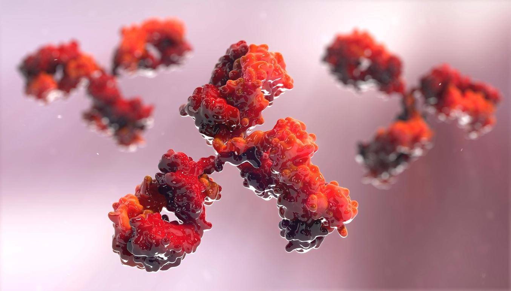

## Course Description

The immuno-oncology approach leverages on the unique capability of the immune system to recognize and kill tumour cells. This action is hampered by escape mechanisms put in place by tumour cells like, for instance, the engagement immune checkpoints, i.e. inhibitory molecules that modulate the amplitude and duration of immune responses. Immunotherapies that block checkpoint molecules are amongst the most promising approaches in immuno-oncology for the enhancement of antitumour immunity. Thanks to high-throughput technologies, such as next-generation sequencing (NGS) and proteomics, we have now access to large-scale tumour data that can be used to investigate the interplay between tumour and immune cells and the role of the immune system in tumour progression and response to therapy. In this course, you will learn to use bioinformatics tools and mathematical modelling techniques operating on high-throughput tumour data, in order to extract features that can be used to characterise this complex tumour-immune cell interface, such as:

* Tumour antigens recognized by T cells
* Tumour-infiltrating immune cells
* Deregulated signalling pathways in cancer and immune cells

A fully practical, hands-on approach will ensure that the newly acquire skills can be used with a great deal of autonomy.

## Target Audience

Motivated researchers, clinicians, and students who want to gain an understanding on how bioinformatics tools and simple (logic-based) modelling approaches can be used to investigate the tumour-immune cell interface and its underlying signalling pathways from high-throughput data.

## Detailed Program

### Day 1
**09:30-11:00**
* Introduction of participants
* [Bioinformatics for Cancer Immunology and Immuno-Oncology](assets/1_1_Intro.pdf)
* [Prediction of tumor neoantigens](assets/1_2_Prediction_of_tumor_neoantigens.pdf)
* [HLA typing](assets/1_3_HLA_typing.pdf)
* [Exercise 1 and questions: HLA typing](assets/Neoantigen_ex_1.pdf)
  * [*Patient_1_RNAseq.fastq*](assets/Input_data/Patient_1_RNAseq.fastq)

**11:30-12:30**
* [Solution: exercise 1 and questions](assets/Neoantigen_ex_1_sol.pdf)
  * [*Patient_1_HLA.txt*](assets/Patient_1_HLA.txt)
  * [*Patient_1_HLA_typing_coverage_plot.pdf*](assets/Patient_1_HLA_typing_coverage_plot.pdf)
* [Variant annotation](assets/1_4_Variant_annotation.pdf)
* [Exercise 2 and questions: variant annotation](assets/Neoantigen_ex_2.pdf)
  * [*Patient_1_mutations.vcf*](assets/Input_data/Patient_1_mutations.vcf)

**14:00-16:00**
* [Solution: exercise 2 and questions](assets/Neoantigen_ex_2_sol.pdf)
  * [*Patient_1_VEP_37_mutations.txt*](assets/Patient_1_VEP_37_mutations.txt)
  * [*Patient_1_VEP_37_proteins.txt*](assets/Patient_1_VEP_37_proteins.txt)
* [Peptide-MHC binding prediction](assets/1_5_Peptide-MHC_binding_prediction.pdf)
* [Exercise 3 and questions: peptide-MHC binding prediction](assets/Neoantigen_ex_3.pdf)
  * [*Patient_1_HLA-A.txt*](assets/Input_data/Patient_1_HLA-A.txt)

**16:30-18:00**
* [Solution: exercise 3 and questions](assets/Neoantigen_ex_3_sol.pdf)
  * [*Patient_1_NetMHCpan_binders.txt*](assets/Patient_1_NetMHCpan_binders.txt)
* [Exercise 4: neoantigen prioritization](assets/Neoantigen_ex_4.pdf)
  * [*Patient_1_normalized_expression.txt*](assets/Input_data/Patient_1_normalized_expression.txt)
* Wrap-up and questions
* Brainstorming: strategies for neoantigen prioritization

 

### Day 2

**09:30-11:00**
* Morning wrap-up
* [Solution: exercise 4 and questions](assets/Neoantigen_ex_4_sol.pdf)
  * [*Patient_1_candidate_neoantigens.txt*](assets/Patient_1_candidate_neoantigens.txt)
* [Discussion about neoantigen prioritization](assets/1_6_Neoantigen_priotization.pdf)
* [Tumor-infiltrating immune cells](assets/2_1_Tumor-infiltrating_immune_cells.pdf)
* [Computational quantification of tumor-infiltrating immune cells](assets/2_2_Computational_quantification_of_tumor_infiltrating_immune_cells.pdf)
* [Exercise 1: deconvolution of PBMC data with CIBERSORT](assets/Deconvolution_ex_1.pdf)
  * [*Mixture_Newman_PBMC.txt*](assets/Input_data/Mixture_Newman_PBMC.txt)
  * [*Signature_CIBERSORT_LM22.txt*](assets/Input_data/Signature_CIBERSORT_LM22.txt)

**11:30-12:30**
* [Assessing deconvolution performance](assets/2_3_Assessing_deconvolution_performance.pdf)
* [Exercise 2: RMSE](assets/Deconvolution_ex_2.pdf)
* [Exercise 3: deconvolution performance (optional)](assets/Deconvolution_ex_3.pdf)

**14:00-16:00**
* Solution: exercise 1
  * [*Decon_CIBERSORT_PBMC_output.txt*](assets/Decon_CIBERSORT_PBMC_output.txt)
  * [*Decon_CIBERSORT_PBMC_cell_fractions.txt*](assets/Decon_CIBERSORT_PBMC_cell_fractions.txt)
* Solution: exercise 2
  * [*Decon_2_RMSE.R*](assets/Decon_2_RMSE.R)
* Solution: exercise 3
  * [*Decon_3_Assess_Performance.R*](assets/Decon_3_Assess_Performance.R)
* [Exercise 4: assess CIBERSORT performance on PBMC data](assets/Deconvolution_ex_4.pdf)
  * [*FlowCytometry_Newman_PBMC.txt*](assets/Input_data/FlowCytometry_Newman_PBMC.txt)

**16:30-18:00**
* Solution: exercise 4
  * [*Decon_4_Assess_Deconvolution_CIBERSORT_PBMC.R*](assets/Decon_4_Assess_Deconvolution_CIBERSORT_PBMC.R)
  * [*Decon_CIBERSORT_PBMC_performance.pdf*](assets/Decon_CIBERSORT_PBMC_performance.pdf)
* [Deconvolution Methods](assets/2_4_Deconvolution_methods.pdf)
* [Exercise 5: Run and assess DeconRNASeq on PBMC data](assets/Deconvolution_ex_5.pdf)
* [Questions: deconvolution](assets/Deconvolution_questions.pdf)
* Wrap-up and questions
* Brainstorming: deconvolution challenges

 

### Day 3

**09:30-11:00**
* Morning wrap-up
* Solution: exercise 5
  * [*Decon_5_Assess_Deconvolution_DeconRNASeq_PBMC.R*](assets/Decon_5_Assess_Deconvolution_DeconRNASeq_PBMC.R)
  * [*Decon_DeconRNASeq_PBMC_cell_fractions.txt*](assets/Decon_DeconRNASeq_PBMC_cell_fractions.txt)
  * [*Decon_DeconRNASeq_PBMC_performance.pdf*](assets/Decon_DeconRNASeq_PBMC_performance.pdf)
  * [*Decon_DeconRNASeq_PBMC_noBnaive_cell_fractions.txt*](assets/Decon_DeconRNASeq_PBMC_noBnaive_cell_fractions.txt)
  * [*Decon_DeconRNASeq_PBMC_noBnaive_performance.pdf*](assets/Decon_DeconRNASeq_PBMC_noBnaive_performance.pdf)
* [Solution: deconvolution questions](assets/Deconvolution_questions_sol.pdf)
* [Discussion about deconvolution challenges](assets/2_5_Deconvolution_challenges.pdf)
* [Signaling pathways in cancer and immune cells](assets/3_1_Signaling_pathways_in_cancer_and_immune_cells.pdf)
* [Exercise 1: pathways analysis with Omnipath](assets/Ex1_Omnipath.pdf)
  * [*Ex1_Omnipath.R*](assets/Ex1_Omnipath.R)

**11:30-12:30**
* Solution: Excercise 1
  * [*Ex1_Omnipath_solution.R*](assets/Ex1_Omnipath_solution.R)
  * [*Ex1_Omnipath_solution.pdf*](assets/Ex1_Omnipath_solution.pdf)
* [Modeling framework and introduction to Boolean models](assets/3_2_Modeling_framework_and_introduction_to_Boolean_models.pdf)
* [Excercise 2: Modeling signaling pathways with Cytocopter (Cytoscape plugin)](assets/Ex2_CytocoptR.pdf)
  * [*ToyModelPB.sif*](assets/Input_data/ToyModelPB.sif)
  * [*ToyModelPB.csv*](assets/Input_data/ToyModelPB.csv)

**14:00-16:00**
* [Introduction to different logic formalisms in CellNOpt](assets/3_3_Introduction_to_different_logic_formalisms_in_CellNOpt.pdf)
* Excercise 3: Comparing different logic formalisms with CellNOptR
  * [*Ex3_tutorialCellNOptR.R*](assets/Ex3_tutorialCellNOptR.R)
  * [*ToyModelPB.sif*](assets/Input_data/ToyModelPB.sif)
  * [*ToyModelPB.csv*](assets/Input_data/ToyModelPB.csv)
* [Exercise 4: Modeling cell-type specific pathways with CNORode](assets/Ex4_modeling_leukemia_with_CNORode.pdf)
  * [*Ex4_modeling_leukemia_with_CNORode.R*](assets/Ex4_modeling_leukemia_with_CNORode.R)
  * [*optimisation_parameters.RData*](assets/Input_data/optimisation_parameters.RData)
  * [*PKN_Lymphocyte.sif*](assets/Input_data/PKN_Lymphocyte.sif)
  * [*MIDAS_CTL.csv*](assets/Input_data/MIDAS_CTL.csv)
  * [*MIDAS_T_LGL.csv*](assets/Input_data/MIDAS_T_LGL.csv)
  * [*MIDAS_predictions.csv*](assets/Input_data/MIDAS_predictions.csv)
 * [Solution: exercise 4](assets/Ex4_modeling_leukemia_with_CNORode_solution.R)

---

### [Instructors](pages/instructors.md)

---

The source for this course webpage is [in github](https://github.com/GTPB/IO17).

 

 IO17 by GTPB is licensed under a <a rel="license" href="http://creativecommons.org/licenses/by/4.0/">Creative Commons Attribution 4.0 International License</a>.
