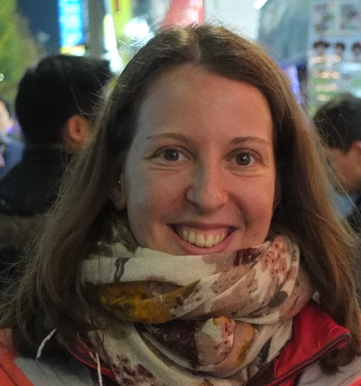

## Francesca Finotello

**Affiliation:** Division of Bioinformatics, Medical University of Innsbruck, AT

**Francesca Finotello** received her PhD in Bioengineering in 2014 from the Department of Information Engineering, University of Padova (Italy). Her PhD thesis, entitled "Computational methods for the analysis of gene expression from RNA sequencing data", was awarded with the "Marco Ramoni" doctoral research award by the Italian National Bioengineering Group.

She has an extensive experience on computational methods for the analysis of different types of next-generation sequencing (NGS) data, including RNA-seq and 16S ribosomal RNA gene sequencing of the human microbiota.

Currently, she is a postdoctoral researcher in the Division of Bioinformatics of Medical University of Innsbruck (Austria). She is interested in bioinformatics and computational biology for cancer immunology and precision medicine, with a particular focus on in silico prediction of tumor neoantigens and deconvolution of tumour-infiltrating immune cells from NGS data. She is principal investigator of the research project "QuanTIseq: dissecting the immune contexture of human cancers" funded by the Österreichischen Krebshilfe Tirol (Austria) and aimed at developing a computational tool for the quantification of immune cell fractions from RNA-seq data of cell mixtures.

---

## Federica Eduati

**Affiliation:** European Molecular Biology Laboratory (EMBL), Heidelberg, DE
JRC-COMBINE (RWTH Aachen), Aachen, DE

**Federica Eduati** received her PhD in Bioengineering in 2013 from the University of Padova, with a thesis (awarded the "Paolo Durst" best Italian PhD Thesis Award in Bioengineering) focusing on mechanistic modelling aspects of both large- and small-scale biological systems.

In 2009 she participated to the DREAM4 "Predictive signaling network modeling" challenge classifying as best performing team. In 2011-2012 she was a visiting predoctoral fellow for 8 months in the Systems Biomedicine group at EBI. Since February 2013 she is a Postdoctoral EIPOD fellow - Marie Curie Fellow at EMBL (UK and Germany). Since May 2016 she is also a visiting scientist at JRC-COMBINE in RWTH Aachen (Germany).

Currently, her main research interest is the investigation of why patients differentially respond to cancer therapy and how we can suggest personalized therapy. In particular, she is interested in approaching this problem by investigating signalling pathways, their deregulation in cancer and the specific effect of targeted therapy, using dynamic mathematical modelling approaches and machine learning techniques.

She has also been working on the development of a microfluidics platform, which allows drug screening of live cells obtained from patient biopsies in a fast and cost-effective way. In 2013 she was also co-organizer of the NIEHS-NCATS-UNC DREAM Toxicogenetics Challenge, where 213 registered participants from more than 30 countries had to predict cell line-specific cytotoxicity to chemical compounds based on genomic data and chemical attributes.

 

### Back

Back to [main page](../index.md).
